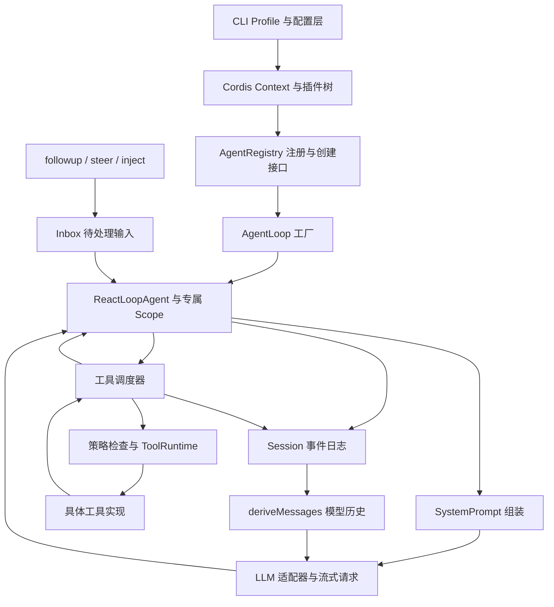

## 先记住主线

**DeepSeek Harness 把模型、工具、会话和执行循环组织成可组合的插件；Agent Loop 负责推进任务，会话日志负责保存已接受的事实。** 阅读时抓住三个问题：输入在哪个边界生效，工具结果按什么顺序进入上下文，取消后由谁完成资源清理。

本文核验于 **2026-10-09**，阅读的是 DeepSeek 官方仓库的固定提交 [`d743267388641bc76f17c45ce8b4c231aed1d32c`](https://github.com/deepseek-ai/deepseek-harness/commit/d743267388641bc76f17c45ce8b4c231aed1d32c)，对应 `0.2.1-alpha.2` 的发布提交，仓库采用 [MIT 许可证](https://github.com/deepseek-ai/deepseek-harness/blob/d743267388641bc76f17c45ce8b4c231aed1d32c/LICENSE)。以下是**静态源码阅读**，未安装运行项目，也未验证模型调用、工具执行或性能；后续版本可能改变内部实现。

## 架构：插件提供能力，循环组织调用

启动侧的 `runProfile()` 先组合配置，再调用 `boot()`；启动环境、插件包解析和命令行能力在装载配置树时注入 Context。业务代码通过 `ctx.agents`、`ctx.tools` 等服务访问能力，避免让每种界面自己实现一套循环。[启动入口](https://github.com/deepseek-ai/deepseek-harness/blob/d743267388641bc76f17c45ce8b4c231aed1d32c/apps/cli/src/profile-boot.ts#L244-L319)

`AgentLoop` 本身也是 `Service`，声明对 agents、sessions、llm、tools、systemPrompt 和 sessionProjections 的依赖，再通过 `setFactory()` 注册默认创建工厂。`ctx.effect()` 绑定注册与撤销动作。每个 Agent 的 `createScope()` 又创建一个 Cordis 插件 Fiber，扩展带有作用域标识的 Context，让局部监听器和注册项有明确的释放边界。这里的 Scope 管理能力与生命周期，不能据此推断操作系统级隔离。[工厂注册](https://github.com/deepseek-ai/deepseek-harness/blob/d743267388641bc76f17c45ce8b4c231aed1d32c/packages/core/agent-loop/src/index.ts#L341-L390)、[Scope 实现](https://github.com/deepseek-ai/deepseek-harness/blob/d743267388641bc76f17c45ce8b4c231aed1d32c/packages/core/scope/src/index.ts#L105-L146)

## 源码定位与调用链

| 阅读位置                            | 先找什么                                          | 解决的问题                       |
| ----------------------------------- | ------------------------------------------------- | -------------------------------- |
| `core/agent/src/index.ts`           | `AgentRegistry.create()`                          | 外部如何统一创建 Agent           |
| `core/agent-loop/src/index.ts`      | `createAgent()`、`setupAndPublish()`、`prepare()` | 会话、驱动、初始化和销毁由谁拥有 |
| `core/agent-loop/src/agent.ts`      | `preStep()`、`step()`、`buildRequest()`           | 一次模型请求何时形成             |
| `core/agent-loop/src/tool-calls.ts` | `executeToolCalls()`、`runGroup()`                | 并发工具如何调度并记账           |
| `core/tools/src/index.ts`           | `prepareExecution()`、`dispatchToolBody()`        | 策略、执行和结果处理如何衔接     |
| `core/session/src/index.ts`         | `append()`、`deriveMessages()`                    | 日志如何变成模型上下文           |

表中路径均位于仓库的 `packages/` 下。创建链路是 `AgentRegistry.create → 已注册工厂的 createAgent → setupAndPublish → prepare → publish`。其中先准备会话及可选持久化句柄，再运行 setup，最后进入注册表并发布创建事件；[创建监听器通过串行异步调用完成](https://github.com/deepseek-ai/deepseek-harness/blob/d743267388641bc76f17c45ce8b4c231aed1d32c/packages/core/agent/src/index.ts#L537-L559)。初始化失败会走回滚，不能把“对象已经 new 出来”等同于“Agent 已可安全工作”。[Registry 委派](https://github.com/deepseek-ai/deepseek-harness/blob/d743267388641bc76f17c45ce8b4c231aed1d32c/packages/core/agent/src/index.ts#L382-L415)、[初始化与回滚](https://github.com/deepseek-ai/deepseek-harness/blob/d743267388641bc76f17c45ce8b4c231aed1d32c/packages/core/agent-loop/src/index.ts#L750-L834)

## Agent Loop：输入、步骤与轮次

### 输入何时生效

`followup()` 写入下一轮队列并唤醒驱动；`steer()` 写入下一步队列并唤醒；`inject()` 也写入下一步，但不主动唤醒。下一轮开始领取输入时，会取出全部 next-step 输入，再取一个 next-turn 消息。因此注入背景材料可以等待后续任务一起消费，而“下一步”也不表示能修改已经发给模型的请求。[输入入口](https://github.com/deepseek-ai/deepseek-harness/blob/d743267388641bc76f17c45ce8b4c231aed1d32c/packages/core/agent-loop/src/agent.ts#L154-L181)、[领取规则](https://github.com/deepseek-ai/deepseek-harness/blob/d743267388641bc76f17c45ce8b4c231aed1d32c/packages/core/agent-loop/src/inbox.ts#L103-L113)

### 一步怎样执行

可以把 `step` 理解为一次模型请求及其工具处理，把 `turn` 理解为一组连续步骤；一次请求内部还可能重试。实际顺序如下：

1. 记录 `turn/start`，领取输入，组装提示词与工具定义，运行 `agent/pre-step` 扩展点。输入被拒绝，或首步被改写为空时，可结束轮次而不调用模型。
2. 记录 `step/start`，通过 `agent/request` 和 `llm.prepareCall()` 确定实际模型路由与能力。
3. 检查取消状态，再提交系统提示和已接受的用户输入；记录请求配置，从 Session 推导并冻结本次历史。
4. 消费模型流，完成消息记录。没有工具调用时可结束；有工具调用时执行工具，再把结果带入后续步骤。
5. 收尾前还会运行 `agent/turn-stopping`；若出现下一步输入，循环可以继续。工具也可通过结果声明结束轮次。

这个顺序的价值在于：**“准备请求”与“接受模型可见输入”有明确边界。** 如果在模型路由准备期间取消，本次输入尚未作为 `user/message` 提交。重试也不会重新领取同一批输入，用户消息只在该步骤的首次尝试提交。[步骤状态机](https://github.com/deepseek-ai/deepseek-harness/blob/d743267388641bc76f17c45ce8b4c231aed1d32c/packages/core/agent-loop/src/agent.ts#L267-L441)、[请求准备与冻结](https://github.com/deepseek-ai/deepseek-harness/blob/d743267388641bc76f17c45ce8b4c231aed1d32c/packages/core/agent-loop/src/agent.ts#L563-L703)

## Session：事件日志不等于聊天数组

`Session.append()` 为数据制作快照、校验结构、分配顺序号并冻结，再提交到日志。模型请求不会直接使用任意可变数组，而由 `deriveMessages()` 按 surface 标记选择、投影消息；轮次边界等事件不进入模型历史，替换操作可改变有效历史而保留原事件。普通追加只处理新节点，历史投影代次变化时重建缓存。[事件提交](https://github.com/deepseek-ai/deepseek-harness/blob/d743267388641bc76f17c45ce8b4c231aed1d32c/packages/core/session/src/index.ts#L798-L897)、[历史推导](https://github.com/deepseek-ai/deepseek-harness/blob/d743267388641bc76f17c45ce8b4c231aed1d32c/packages/core/session/src/index.ts#L960-L1005)

流式展示与最终记录也分开：增量帧通过 `agent/assistant-stream` 发出，成功消息提交为 `assistant/message`；部分失败或重试记录为 `assistant/attempt`。取消时若存在可保留内容，则记录带 `interrupted` 标记的消息，否则记录尝试。这能保留诊断事实，同时避免把所有失败流都当作正常回答。[流的结算分支](https://github.com/deepseek-ai/deepseek-harness/blob/d743267388641bc76f17c45ce8b4c231aed1d32c/packages/core/agent-loop/src/agent.ts#L443-L546)

需要区分内存日志提交和存储完成：`append()` 本身是同步内存操作；持久化由相应后端参与，销毁时还要等待写入句柄关闭。能从日志推导请求，并不代表进程突然退出前的每个流片段都已落盘。

## 工具：执行可并发，结果按序提交

调度器先读取工具的执行模式：独占调用形成屏障，允许并行的调用进入有上限的执行池。后续调用启动前还会重新检查模式，避免注册表变化后继续沿用旧分类。真正重叠的是工具分派与执行；前置策略及结果提交仍遵循模型给出的顺序。[工具调度](https://github.com/deepseek-ai/deepseek-harness/blob/d743267388641bc76f17c45ce8b4c231aed1d32c/packages/core/agent-loop/src/tool-calls.ts#L60-L235)

例如模型依次请求 A、B，B 先完成时先保存在自己的 slot，`commitReady()` 必须等 A 就绪才能推进连续提交位置。这有利于日志和附加上下文保持稳定顺序，代价是慢工具可能拖住后续结果的可见性；它没有让并行工具的外部副作用自动获得相同顺序。

ToolRuntime 的主要处理链是：`tools/pre-execute` 决策 → 必要的询问与 guard 检查 → `tools/execute` 包装 → 注册工具的 `execute()` → 后置处理与最终结果通知。策略可以允许、拒绝或取消。调度器写入 `tool/call`，再将 `tool/result` 关联到调用事件的序号，便于回放时知道结果属于谁。[执行管线](https://github.com/deepseek-ai/deepseek-harness/blob/d743267388641bc76f17c45ce8b4c231aed1d32c/packages/core/tools/src/index.ts#L1495-L1689)、[结果关联](https://github.com/deepseek-ai/deepseek-harness/blob/d743267388641bc76f17c45ce8b4c231aed1d32c/packages/core/agent-loop/src/tool-calls.ts#L249-L289)

## 取消与销毁：先停止工作，再释放所有权

`cancel()` 默认清空待处理输入，并对当前活动的 AbortController 发出取消；它不是立即删除 Agent。调度器停止补充新调用，等待已经启动的调用结束，再为未启动调用补上取消结果。工具执行器把原始调用方信号与包装层信号合并，避免包装器意外丢失取消；已开始的工具 Promise 仍需收敛。[取消后的调度](https://github.com/deepseek-ai/deepseek-harness/blob/d743267388641bc76f17c45ce8b4c231aed1d32c/packages/core/agent-loop/src/tool-calls.ts#L216-L259)、[信号合并](https://github.com/deepseek-ai/deepseek-harness/blob/d743267388641bc76f17c45ce8b4c231aed1d32c/packages/core/tools/src/index.ts#L1547-L1597)

因此，一个忽略信号且长期不返回的工具仍可能拖延停止；已发送的邮件、已提交的数据库写入也不会因 abort 自动撤销。这是从等待工具结束的实现推导出的边界，工具需要自行提供超时、幂等和补偿语义。

生命周期销毁更进一步：以 `disposed` 原因取消 → 等 `whenIdle()` → 释放 Scope → 关闭持久化句柄 → 从 Agent 和 Session 注册表移除。多个销毁请求复用同一个 Promise；各清理阶段收集失败，仍继续释放后续资源，最后报告错误。这样可以让循环先记录结束事件，再完成存储和注册关系的清理。[销毁次序](https://github.com/deepseek-ai/deepseek-harness/blob/d743267388641bc76f17c45ce8b4c231aed1d32c/packages/core/agent-loop/src/index.ts#L520-L600)

## 值得迁移到自己项目的取舍

| 设计                     | 收益                         | 需要承担的成本                 |
| ------------------------ | ---------------------------- | ------------------------------ |
| 能力以插件和服务接口组合 | 可替换模型、工具与循环实现   | 依赖、作用域和卸载顺序更复杂   |
| 输入在步骤边界领取       | 新指令有明确生效点           | 无法修改已经发出的请求         |
| 事件日志投影模型历史     | 回放、诊断与恢复共用事实来源 | 需要管理事件格式和历史替换规则 |
| 并发执行、按序提交结果   | 提高工具吞吐并保持上下文顺序 | 结果可见性可能受慢调用影响     |
| 取消后等待收尾           | 避免运行中资源失去所有者     | 停止速度取决于工具的协作能力   |

做自己的最小 Agent 时，可以先实现输入队列、一次请求、一个工具和完整结束事件，再增加并发与插件化。静态阅读之后可设计三个实验：准备模型路由时取消，检查用户消息是否提交；让 B 比 A 先完成，检查结果顺序；让工具收到取消后延迟退出，检查资源何时释放。这里列的是验证任务，没有声称这些实验已经通过。

## 五道自测

1. inject 和 steer 都写入 next-step，差别是什么？

steer 会唤醒驱动，inject 不会。只有背景注入而没有唤醒任务时，材料可以继续等待；两者都不会直接改写在途模型请求。

2. 为什么 prepareCall 要在提交用户消息之前？

先确认实际路由和能力，再跨过输入接受边界。准备期间失败或取消时，不把本次输入记成已经进入模型上下文；这也让提示更新依据真实适配器能力处理。

3. 并行工具 B 先完成，为什么可能暂时看不到它的结果？

调度器只按模型顺序推进连续提交位置。B 可以先执行完，但必须等前面的 A 形成结果；这保证日志顺序，不保证外部副作用顺序。

4. Session 日志中的事件会全部发给模型吗？

不会。deriveMessages 按有效 surface 节点及投影生成历史；轮次事件和 assistant/attempt 等诊断事实不会因此自动变成模型消息。

5. cancel 返回后，能立即关闭数据库连接或卸载工具插件吗？

不能仅凭取消已发出来判断。应等待活动结束，再按所有权顺序释放资源；已启动工具仍可能在收尾，外部写入是否撤销需要业务机制保证。

