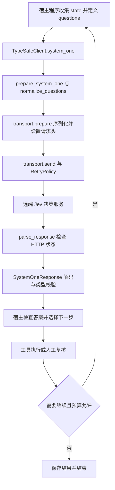

<!-- Original study article for guide, 2026-10-09: inspect the official public SDK without inferring private model internals. -->

**Jev 的 SDK 调用层公开，但模型内部实现不能从 SDK 推导。**截至 2026-10-09，在本次核验的 [TypeSafe 官网](https://typesafe.ai/)、[官方文档](https://docs.typesafe.ai/introduction)和官方 SDK 仓库中，未见 Jev 模型权重、训练实现及内部推理代码公开。因此本文分析请求与决策接口，不分析其内部算法，也不把 SDK 称为完整 Agent 源码。

本文为 guide 原创补充，固定阅读官方 Python SDK **v0.7.3**，commit 为 [`c743d814166a1bb5c47ea9929c020f467c923f0d`](https://github.com/typesafe-ai/typesafe-sdk-python/commit/c743d814166a1bb5c47ea9929c020f467c923f0d)。以下源码链接均指向该版本；完成的是静态阅读，未调用实际 API，未验证模型速度、正确率或成本。

## 先抓住输入输出

TypeSafe 将 Jev 定位为 System One 模型：应用提交 **state + typed questions**，接收可以进入控制流的答案。`state` 是待判断的文本、对象或数组；`questions` 是以问题名为键的映射。状态提供证据，问题定义判断维度，问题名用于关联响应。[官方介绍](https://docs.typesafe.ai/introduction)建议把复杂判断拆成原子问题，再由代码组合结果。

| 类型     | 要问什么                   | 返回的核心内容                            |
| -------- | -------------------------- | ----------------------------------------- |
| `Choice` | 在无序候选项中选哪一个     | `choice`、候选概率、`confidence`          |
| `Score`  | 落在有序评价等级的什么位置 | `score`、等级概率、`legend`、`confidence` |
| `Noul`   | 一个判断是否为真           | `noul`，表示“是”的概率                    |

例如工单系统可以分别问“属于哪个团队”“影响程度如何”“是否需要补充材料”。同一请求可携带三类问题。它们针对同一状态判断；如果第二问必须依赖第一问的答案，宿主程序需要取得结果后再组织下一次调用，不能把批量问题误认为串行推理链。

## 一次调用经过哪些层



图中循环、工具执行和预算判断属于宿主设计。SDK 的一次请求只是其中一个节点。

### 1. 客户端处理配置

[`client/sync/client.py`](https://github.com/typesafe-ai/typesafe-sdk-python/blob/c743d814166a1bb5c47ea9929c020f467c923f0d/src/typesafe_sdk/_core/client/sync/client.py)中的构造函数调用 `Config.resolve`，初始化 HTTP 客户端和重试策略；`system_one` 再调用请求构造器与 `_request`。这里使用的网络库是 **httpx2**。

[`config.py`](https://github.com/typesafe-ai/typesafe-sdk-python/blob/c743d814166a1bb5c47ea9929c020f467c923f0d/src/typesafe_sdk/_core/config.py)会解析参数及环境配置，检查密钥格式和超时值。显式参数优先于环境变量。`with TypeSafeClient()` 的退出方法负责关闭连接资源；这些代码没有模型加载或训练过程。

### 2. 输入校验与请求构造

[`question_types.py`](https://github.com/typesafe-ai/typesafe-sdk-python/blob/c743d814166a1bb5c47ea9929c020f467c923f0d/src/typesafe_sdk/_core/question_types.py)用 Pydantic 表达三类问题，对象形式拒绝未知字段；`Score.criteria` 至少有一项。[`questions.py`](https://github.com/typesafe-ai/typesafe-sdk-python/blob/c743d814166a1bb5c47ea9929c020f467c923f0d/src/typesafe_sdk/_core/questions.py)进一步检查问题集合非空、Choice 候选项非空，以及 Noul 是否提供问题或有效的结果描述。

校验并非无所不包：字典形式只做相应的局部检查，不能因此认定所有业务语义都已验证。[`endpoints.py`](https://github.com/typesafe-ai/typesafe-sdk-python/blob/c743d814166a1bb5c47ea9929c020f467c923f0d/src/typesafe_sdk/_core/endpoints.py)拒绝 `state=None`，构造 `state/model/questions` 后，还会用 `extra_body` 浅覆盖请求体。因此扩展参数可能替换已经处理的同名字段，调用方需要控制其来源。

### 3. 发送、解码与结果对象

[`transport.py`](https://github.com/typesafe-ai/typesafe-sdk-python/blob/c743d814166a1bb5c47ea9929c020f467c923f0d/src/typesafe_sdk/_core/transport.py)将请求体序列化，设置 Bearer 认证、JSON 内容类型及 SDK 标识，然后发送请求。目标路径由[协议常量](https://github.com/typesafe-ai/typesafe-sdk-python/blob/c743d814166a1bb5c47ea9929c020f467c923f0d/src/typesafe_sdk/_core/constants.py)定义为 `POST /v1/systemone`。

[`schemas/base.py`](https://github.com/typesafe-ai/typesafe-sdk-python/blob/c743d814166a1bb5c47ea9929c020f467c923f0d/src/typesafe_sdk/_core/schemas/base.py)先检查 HTTP 状态，再解码响应。[`response_types.py`](https://github.com/typesafe-ai/typesafe-sdk-python/blob/c743d814166a1bb5c47ea9929c020f467c923f0d/src/typesafe_sdk/_core/response_types.py)按 `type` 区分答案，提供 `choices/scores/nouls` 视图，把 Score 的 JSON 字符串等级键转成整数，并保留模型信息、用量与原始 HTTP 响应。

因此“类型化决策”仍包含 JSON 解析与结构校验。该版本还会跳过未来新增的未知答案类型；调用方应检查必要的问题是否有答案。生成的[线协议模型](https://github.com/typesafe-ai/typesafe-sdk-python/blob/c743d814166a1bb5c47ea9929c020f467c923f0d/src/typesafe_sdk/_schemas/models.py)对概率使用浮点字段，未写出完整的范围、求和及候选项一致性约束。结构能解析，不代表业务结果正确。

## 错误处理与重试

[`errors.py`](https://github.com/typesafe-ai/typesafe-sdk-python/blob/c743d814166a1bb5c47ea9929c020f467c923f0d/src/typesafe_sdk/_core/errors.py)区分认证、权限、限流、服务端错误，以及连接、超时和响应结构错误。排查时先判断失败属于输入、网络、服务端还是解码层，再决定如何处理。

[`retry.py`](https://github.com/typesafe-ai/typesafe-sdk-python/blob/c743d814166a1bb5c47ea9929c020f467c923f0d/src/typesafe_sdk/_core/retry.py)用 Tenacity 实现策略：默认初次失败后最多重试 **2 次**，即最多尝试 **3 次**；连接错误、超时、408、429 和 5xx 可触发重试。优先采用 `Retry-After` 等响应头，否则进行带抖动的指数退避。默认重试预算为 30 秒，但这不是强制中断正在进行的网络操作，仍需单独配置 HTTP 超时。

401、403 或无效问题不应靠盲目重试解决。HTTP 成功但结构校验失败也不是默认重试状态。SDK 重试请求，更不等于宿主可以重复执行退款、写库等动作；副作用的幂等与去重应由业务系统保证。

## SDK 版本与模型版本分别记录

固定源码提交，只能固定客户端行为。[默认配置](https://github.com/typesafe-ai/typesafe-sdk-python/blob/c743d814166a1bb5c47ea9929c020f467c923f0d/src/typesafe_sdk/constants.py)使用 `jev-latest` 模型别名，服务端别名指向的版本可能变化。因此做对比实验时，应同时记录 SDK 提交、请求模型名、响应中的实际模型名、问题描述、输入数据版本与阈值。

验证也要分层：模拟 HTTP 响应可以检查序列化、异常映射和重试；真实接口调用可以检查认证及协议是否接通；只有带标注的业务样本才能评价分类错误、概率校准和自动处理覆盖率。前一层通过，不代表后一层已经成立。问题描述或候选项发生变化后，原来选定的阈值也需要重新检查。

## 概率、置信度和正确率

**概率描述候选结果，confidence 概括分布，正确率依赖带答案的数据集。**三者不能互换。

按照[官方置信度定义](https://docs.typesafe.ai/confidence)，当 Choice 有 `n > 1` 个选项时：

`confidence = (p_max - 1/n) / (1 - 1/n)`，其中 `p_max` 是候选项的最高概率。

三个选项的概率若为 `0.6、0.3、0.1`，最高概率是 `0.6`，置信度却是 `0.4`。它衡量相对均匀分布的集中程度，不能解释为“这次有 40% 的正确率”。Noul 返回“是”的概率，没有独立的 `confidence` 字段。

[Score](https://docs.typesafe.ai/primitives/score)是等级编号的概率加权平均，可以是小数。同样的平均分可能来自不同分布，不能只留一个分数就丢掉不确定性。置信度很高也可能答错；是否校准，需要在业务样本中比较预测概率与实际发生频率。SDK 的字段和解析代码无法证明模型已在你的数据上校准。

## 与 Agent Loop 怎样组合

宿主掌握完整目标、工具权限、状态更新、失败恢复和停止条件。Jev 可以承担某个路由或评分判断；SDK 不会自动创建计划、执行工具或维护完整 Agent 循环。

下面是**原创教学伪码，不是实际 SDK 调用或线上请求格式**。阈值由业务评测确定，示例不提供通用默认值。

```text
state = 收集当前证据()
questions = 定义分类、评分与是否缺少材料的问题()
answers = 调用一次决策服务(state, questions)

if 必要答案缺失(answers) or 不符合业务约束(answers):
    记录异常并结束()
elif 未达到已验证的自动处理阈值(answers):
    进入人工复核队列()
else:
    action = 宿主依据答案选择允许的动作(answers)
    检查权限与幂等键(action)
    result = 执行动作(action)
    保存状态与调用证据(result)
```

把一次判断封装好，再让宿主控制后续步骤，是这份公开源码能够支持的工程结论。更完整的循环可结合[Agent 核心概念](../agent/agent-basis.md)和[工作流、Graph 与 Loop](../agent/workflow-graph-loop.md)复习。

## 五题自测

1. **SDK 开源能否证明模型算法公开？**不能；这里能追踪客户端协议与处理流程，不能看到权重、训练和内部推理实现。
2. **Score 为何能返回小数？**它是等级编号的概率加权平均；还应查看分布，而非直接当成离散等级。
3. **confidence 为 1 能否跳过权限检查？**不能。分布集中不保证语义正确，也不授予操作权限。
4. **默认重试 2 次意味着什么？**连同首次请求最多尝试 3 次；还受错误类型、等待时间及预算约束。
5. **多个问题放进一次调用就是 Agent Loop 吗？**不是。依赖前次答案的新状态、工具执行和停止判断仍由宿主组织。
