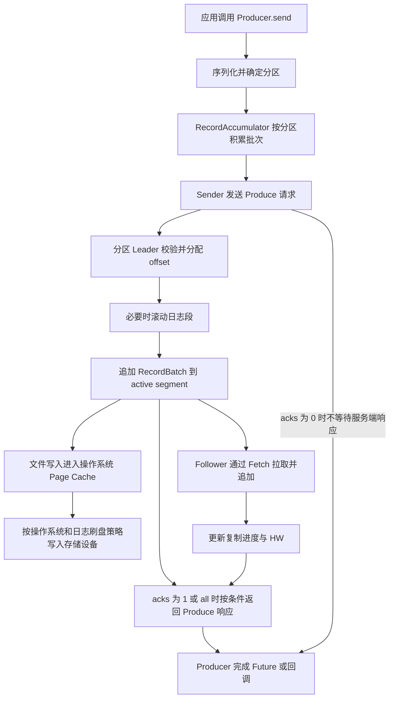
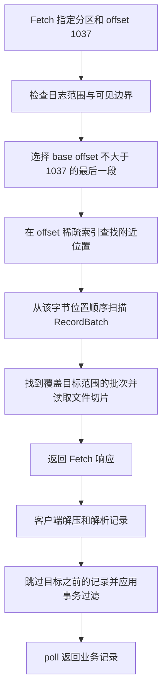

## 先记住两条主线

**写入：消息先在 Producer 中组成批次，经 Produce 请求发送给分区 Leader，追加到当前日志段，再依据 ACK 配置完成发送确认。读取：先选日志段，再查稀疏索引找到附近的文件位置，最后扫描消息批次并返回可见数据。**

这里的“日志”是 Kafka 存储消息的分区日志，不是 Broker 自己输出的 `server.log`。“搜索”主要指按 **offset 或时间戳定位消息**；如果要检索 `traceId`、错误关键词或 JSON 字段，需要消费后过滤，或者建立外部搜索索引。

下面以 **Apache Kafka 4.1.0 的本地日志实现**和 4.1 系列 Java Consumer API 为依据。先掌握 [Kafka 基础概念](./kafka-questions-01.md)，再沿两条链路阅读；远端分层存储的下载与缓存流程不在本篇范围内。

## 日志由哪些文件组成

一个 Topic 可以有多个 Partition；同一分区在不同 Broker 上的副本，各自维护本地日志。每份分区日志拆成多个 **LogSegment**，正常追加写入最后一个 active segment。

下面是省略检查点、快照等辅助文件后的教学目录：

```text
orders-0/
  00000000000000000000.log
  00000000000000000000.index
  00000000000000000000.timeindex
  00000000000000001000.log
  00000000000000001000.index
  00000000000000001000.timeindex
```

文件名前缀是该段的 **base offset**，用于组织日志范围，不是字节数，也不能在压缩清理后直接当成“当前保留的第一条业务消息”。[RecordBatch 格式](https://kafka.apache.org/41/implementation/message-format/)通过批次的 `baseOffset` 与记录的 offset delta 表达逻辑位置。

| 对象         | 保存什么                             | 解决什么问题                       |
| ------------ | ------------------------------------ | ---------------------------------- |
| `.log`       | RecordBatch 及其中的记录             | 保存消息正文和批次元数据           |
| `.index`     | 相对 offset 与文件字节位置的稀疏映射 | 从逻辑位置跳到附近批次             |
| `.timeindex` | 时间戳与 offset 的稀疏映射           | 先按时间缩小范围，再走 offset 定位 |
| `.txnindex`  | 已中止事务的相关范围信息             | 配合事务读取过滤，按需存在         |

**offset 是分区内的逻辑编号，position 才是 `.log` 文件内的字节位置。** `(topic, partition, offset)` 才能定位到特定分区中的记录；不同分区的 offset 不能直接比较先后。消息长短、压缩比例和批次大小都不同，所以不能用 `offset × 固定消息大小` 算物理地址。

## 日志写入的完整过程



图中的刷盘与复制是不同维度：`acks=all` 等待复制确认条件，不以“本次消息在每个副本上都执行过 fsync”为返回条件。

### 第一步 生产者序列化并选择分区

`send()` 把 key、value 序列化为字节，并依据显式 partition、分区器和客户端配置选择目标分区。常见的相同 key 路由规则有利于把相关事件放进同一分区，但扩容分区或更换分区器会改变映射，不能把 key 当作跨配置变化的永久路由承诺。

生产者需要元数据来确定分区 Leader。`send()` 通常异步返回，但等待元数据或缓冲区空间时仍可能阻塞。**`send()` 返回不代表发送成功；应检查 Future 或回调，也要处理调用直接抛出的异常。** 某些失败会通过已经失败的 Future 返回，不能把拿到 Future 等同于成功入队。

### 第二步 在客户端形成批次

`RecordAccumulator` 按分区积累记录。`batch.size`、`linger.ms`、缓冲区压力以及 Broker 是否可发送等条件共同影响批次什么时候交给 `Sender`。`Sender` 将发往同一 Broker 的多个分区批次组织进请求，减少网络往返。

压缩围绕 RecordBatch 工作。同一批次可能包含多条记录，也可以只有一条。批处理和压缩能减少请求次数与传输字节，但等待凑批也会增加部分消息的延迟。相关参数见 [Producer 配置](https://kafka.apache.org/41/configuration/producer-configs/)。

### 第三步 Leader 校验并追加日志

Broker 收到 Produce 请求后进行权限、目标分区及领导权等检查，进入分区追加流程。日志层再校验批次格式、大小和相关生产者状态。幂等生产者的 producer ID、epoch 和 sequence 用于识别重试；业务主动发送两次相同 JSON，不会仅因内容相同就自动去重。

Leader 为新追加的记录确定分区 offset，按需要处理时间戳、压缩格式与生产者状态，然后通过 `LocalLog`、`LogSegment` 把批次追加到文件尾部。不能把整条链路概括成“Broker 永远不解析、不校验、不改任何字节”。

新写入由 active segment 承接。达到段大小、滚动时间或索引容量等条件时会滚动到新段；因此段文件不是“一天一个”，也不是“每条消息一个”。`LogSegment.append()` 在追加批次时更新统计信息，并按索引间隔维护稀疏索引；不是每条消息都占一条 `.index` 记录。

### 第四步 区分文件追加和持久化完成

`FileRecords.append()` 通过文件通道写入。常规缓冲 I/O 路径下，数据先进入操作系统 Page Cache，之后由操作系统回写或 Kafka 的 flush 机制推动刷盘。`FileRecords.flush()` 使用文件通道的 `force`，它和普通 append 不是同一操作。[Kafka 存储设计](https://kafka.apache.org/41/design/design/#persistence)说明了依赖文件系统缓存的原因。

进程退出、操作系统崩溃、整机断电和多副本同时失效是不同故障。进程退出不必然丢掉操作系统页缓存；系统或设备故障则可能影响尚未稳定写入的数据。可靠性要结合副本、故障域、刷盘与设备行为判断，不能只凭“顺序写”或“收到了 ACK”推导出任意故障下都不丢数据。

### 第五步 副本复制与发送确认

Follower 主动向 Leader Fetch 数据，并按 Leader 已分配的 offset 追加到自己的日志。Leader 根据复制进度推进 HW，再唤醒满足条件的等待请求。

| 配置       | 发送确认的主要条件                  | 不能据此推出什么                 |
| ---------- | ----------------------------------- | -------------------------------- |
| `acks=0`   | 不等待 Broker 的 Produce 确认       | Broker 一定收到、保存成功        |
| `acks=1`   | Leader 完成本地追加后确认           | Follower 已追上，或已 fsync      |
| `acks=all` | 等待 ISR 复制及最低同步副本要求满足 | 所有配置副本都在线且全部物理刷盘 |

以副本数 3、`min.insync.replicas=2`、`acks=all` 为例：ISR 中只有 2 个副本且满足确认条件时仍可成功；只剩 1 个时不能继续按同样条件确认成功。**min ISR 是最低要求，不是“从当前 ISR 中任意挑两个确认，其余不管”。** ISR 成员会随复制状态变化，具体响应还受超时与错误影响。超时也不能简单解释为“服务器一定没有写进去”。

本篇的 Kafka 4.1.0 实现采用 strict min ISR：ISR 数量低于有效 min ISR 时 HW 不再推进，这个检查不只针对某一次 `acks=all` 请求，也不是仅在启用 ELR 后才执行。正常配置通常让 min ISR 不超过副本数；该版本源码中的有效值还会取配置值与副本数的较小者。

ELR 自 Kafka 4.0 提供，4.1 新建集群默认启用，升级集群则需核对 feature 状态。它维护可安全参与选主的 ELR 集合，因此“只有当前 ISR 成员才可能安全当选 Leader”也不能直接套用到所有版本。参见 [ELR 官方说明](https://kafka.apache.org/41/operations/eligible-leader-replicas/)。

## 日志搜索一 按 offset 定位消息

假设读取 `orders` 的分区 0，目标 offset 为 **1037**。一次典型本地读取分三层。



### 第一层 根据 base offset 选择 segment

如果当前段的 base offset 分别是 `0、1000、2000`，1037 应先查 base 为 1000 的段。源码通过有序的 segment 集合执行 `floorEntry` 一类查找，找到 **base offset 小于等于目标的最大项**。

文件名只能帮助选择范围，不保证目标记录仍存在。保留策略会删除旧段，compaction 会移除部分旧记录，读取时还要检查 log start offset、日志末尾与后续段。

候选段没有合适数据时，读取逻辑会继续尝试后续段，不能因第一段没找到就宣布整个分区没有数据。

### 第二层 用稀疏 offset 索引找附近位置

`.index` 保存相对该段 base offset 的编号与批次物理位置。Kafka 4.1.0 中，采样项使用 **该批次的 last offset** 与 **该批次起始字节位置**。所以索引命中后通常仍要扫描批次，不能直接把命中项当作目标记录的精确地址。

下面的数字是教学示意，不是真实消息大小或默认索引间隔：

| 相对 offset | 对应绝对 offset | 文件字节位置 | 含义                                              |
| ----------- | --------------- | ------------ | ------------------------------------------------- |
| 25          | 1025            | 4096         | 被采样批次的末尾编号为 1025，批次从字节 4096 开始 |
| 60          | 1060            | 8192         | 被采样批次的末尾编号为 1060，批次从字节 8192 开始 |

目标相对 offset 为 `1037 - 1000 = 37`。对索引做 floor lookup，得到不大于 37 的最大项 **25 → 4096**，所以先从 4096 开始扫。如果找不到更小的索引项，则使用段的起始位置；不能假设每段一定有一条真实的 `0 → 0` 索引项。

### 第三层 从附近位置扫描批次

假设字节 4096 处的批次包含 `1021～1025`，它还没覆盖 1037，继续按批次长度前进；遇到覆盖 `1036～1040` 的批次时，就找到了目标所在范围。批次压缩时，也不能直接取“第 1037 个字节”，客户端需要解压并按记录 offset 解码。

Broker 可按批次边界返回数据，Java Consumer 再跳过小于请求位置的记录。若 1037 已被 compaction 清理，但后面的 1038 仍存在，下一条返回的记录可能是 1038。**offset 空洞不等于本次网络丢包；读取定位也不保证一定返回指定编号。** 若目标已早于可保留范围，则涉及 offset 越界和 `auto.offset.reset` 策略。

这条链路可在 [LogSegments](https://github.com/apache/kafka/blob/4.1.0/storage/src/main/java/org/apache/kafka/storage/internals/log/LogSegments.java)、[OffsetIndex](https://github.com/apache/kafka/blob/4.1.0/storage/src/main/java/org/apache/kafka/storage/internals/log/OffsetIndex.java)、[LogSegment](https://github.com/apache/kafka/blob/4.1.0/storage/src/main/java/org/apache/kafka/storage/internals/log/LogSegment.java) 与 [FileRecords](https://github.com/apache/kafka/blob/4.1.0/clients/src/main/java/org/apache/kafka/common/record/FileRecords.java) 中对应起来。

## 日志搜索二 按时间戳定位消息

Java Consumer 的 `offsetsForTimes()` 接收各分区的目标时间戳，返回各分区中 **timestamp 大于等于目标值的最早 offset**。这里“最早”比较的是 offset，不是先把所有记录按时间排序，也不是跨分区返回一条全局最早消息。

典型的本地查找过程是：

1. 根据各 segment 的最大时间戳等信息，寻找可能包含目标的候选段。
2. 在 `.timeindex` 中查找不大于目标时间的索引项，得到一个可继续查找的 offset。
3. 用 `.index` 把 offset 转成附近的文件位置。
4. 扫描批次和记录，检查实际 timestamp，找到满足条件的记录。

`.timeindex` 是稀疏的时间定位辅助结构，不是正文搜索索引，也不意味着每条记录的 timestamp 严格递增。[TimeIndex](https://github.com/apache/kafka/blob/4.1.0/storage/src/main/java/org/apache/kafka/storage/internals/log/TimeIndex.java) 与 `LogSegment.findOffsetByTimestamp()` 共同完成这个过程。

### 时间戳乱序会怎样

如果 Topic 使用 `CreateTime`，记录时间来自生产者，不同设备时钟和补发消息可能造成乱序；`LogAppendTime` 则由 Broker 记录追加时间，业务事件发生时间还可能在 value 里。查找用的是 Kafka 记录 timestamp，不会自动读取 JSON 中的 `eventTime` 字段。

| offset | Kafka 记录 timestamp |
| ------ | -------------------- |
| 1034   | 10:00:02             |
| 1035   | 09:59:59             |
| 1036   | 10:00:05             |
| 1037   | 10:00:03             |

搜索 `10:00:03` 会先定位到 **1036**，因为它是在 offset 顺序中第一条 timestamp 满足条件的记录。搜索 `10:00:04` 也先得到 1036，但接着消费的 1037 时间却更早。因此定位后若要筛选时间窗口，还需逐条检查 timestamp，不能遇到一次超出窗口就武断认定后续全都超出。

没有符合条件的记录时，返回映射中的该分区值可能为 `null`；认证、超时和不支持的接口等问题则可能抛异常。`offsetsForTimes()` 只查位置，不会自动改变消费进度；还需调用 `seek()`，再 `poll()`。API 语义见 [KafkaConsumer](<https://kafka.apache.org/41/javadoc/org/apache/kafka/clients/consumer/KafkaConsumer.html#offsetsForTimes(java.util.Map)>)。

时间查询同样受隔离级别对应的可读取上界限制。定位、seek 与 poll 是分开的操作，期间仍可能发生清理、截断或事务状态变化；得到一个 offset 不代表随后一定能收到该编号的业务记录。

## 为什么日志里有数据但消费者暂时读不到

找到物理文件之后，还要判断消息是否可见。以下边界都采用“下一条位置”表达，即上界本身不包含在可读取范围中。

| 概念             | 含义                                      | 示例                                                     |
| ---------------- | ----------------------------------------- | -------------------------------------------------------- |
| LEO              | 某副本日志末尾的下一 offset               | 最后追加 1099，则 LEO 为 1100                            |
| HW               | 已达到复制可见条件的边界                  | HW 为 1090，则普通消费者只能读取 offset 小于 1090 的范围 |
| LSO              | HW 与最早尚未稳定事务起始 offset 的较小值 | 尚未稳定的事务从 1080 开始，则 LSO 可停在 1080           |
| committed offset | 消费组保存的恢复位置                      | 业务处理完 1074 后通常提交 1075                          |

**消费组 committed offset 与 HW、LSO 不是同一个“提交”。** 前者记录应用从哪里继续，后两者限制 Broker 能向消费者暴露什么。

不存在尚未稳定的事务时，LSO 等于 HW。

`read_uncommitted` 仍受 HW 限制，并不是允许读到 Leader 的所有未复制尾部数据；`read_committed` 还受 LSO 限制，并过滤已中止事务的记录。未完成事务可能让后面已经写入的记录一起等待。事务控制记录也占 offset，但不会作为普通业务消息交给应用，因此应用看到的 offset 不必连续。

“事务稳定”还涉及结束标记的复制可见性，不能只凭某个进程已经发出了 commit 请求来判断。源码可对照 [FetchIsolation](https://github.com/apache/kafka/blob/4.1.0/server-common/src/main/java/org/apache/kafka/server/storage/log/FetchIsolation.java) 的边界选择，以及 [CompletedFetch](https://github.com/apache/kafka/blob/4.1.0/clients/src/main/java/org/apache/kafka/clients/consumer/internals/CompletedFetch.java) 的客户端记录过滤。

`seek()` 只修改消费位置，不会重新写入日志，也不会自动提交消费组 offset。常规读取先从 Leader 讲起，但 Kafka 也支持配置优选副本读取，不能把“消费者永远只能访问 Leader”当成绝对规则。

## 一个按时间回看的 Java 示例

下面展示已有连接配置 `props` 下的核心调用，需配置正确的地址、反序列化器及集群认证。它使用手动分区分配、关闭自动提交，做有限次数的读取；不与 `subscribe()` 混用，不调用消费组提交接口。示例意在说明调用顺序，不是完整的历史日志检索工具。

```java
props.put(ConsumerConfig.ENABLE_AUTO_COMMIT_CONFIG, "false");
props.put(ConsumerConfig.ISOLATION_LEVEL_CONFIG, "read_committed");

TopicPartition tp = new TopicPartition("orders", 0);
long targetMillis = Instant.parse("2026-10-11T02:00:00Z").toEpochMilli();

try (KafkaConsumer<String, String> consumer = new KafkaConsumer<>(props)) {
    consumer.assign(List.of(tp));
    OffsetAndTimestamp hit = consumer.offsetsForTimes(
            Map.of(tp, targetMillis), Duration.ofSeconds(5)).get(tp);

    if (hit == null) {
        System.out.println("该分区未找到满足时间条件的记录");
    } else {
        consumer.seek(tp, hit.offset());
        for (int attempt = 0; attempt < 10; attempt++) {
            ConsumerRecords<String, String> records =
                    consumer.poll(Duration.ofMillis(500));
            for (ConsumerRecord<String, String> record : records.records(tp)) {
                if (record.timestamp() >= targetMillis) {
                    System.out.printf("%s-%d offset=%d timestamp=%d%n",
                            record.topic(), record.partition(),
                            record.offset(), record.timestamp());
                }
            }
        }
    }
}
```

一次空 `poll()` 不能证明历史范围没有数据，可能还在建立连接、拉取元数据或等待可见边界。这个示例也不承诺遍历完整时间范围。真正的回看工具应记录查询开始时各分区的结束边界，设置总耗时和结果数量限制，并处理日志清理、分区变化、权限错误及事务可见性。

若要查整个 Topic，需要逐分区定位。不同分区没有全局 offset；汇总结果时应保留 topic、partition、offset、timestamp，避免把排序展示误认为 Kafka 提供了全局写入顺序。

## 如果要按关键词或 traceId 搜索

Kafka 的 key 通常用于分区选择、compaction 等语义，**不等于提供 `get(key)` 或全文查询接口**。要找某个 `traceId`，可以在受控时间范围内消费并过滤，但代价随扫描数据量增长。

更适合长期检索的架构是：

```text
业务日志 → Kafka 缓冲与重放 → 消费解析 → 搜索或分析存储 → 查询界面
```

例如写入 [Elasticsearch](../../database/elasticsearch/elasticsearch-questions-01.md) 时，消费侧解析字段、建立索引，并保存 Kafka 的 topic、partition、offset 作为回查线索。搜索延迟还包含消费积压和索引可见性延迟；Kafka 已写入不代表搜索界面立刻可见。重放时可用原始位置组成确定性文档 ID，或采用业务事件 ID 做幂等，具体取决于是否要合并业务重复事件。

## 源码阅读顺序

下面链接固定在 `4.1.0` tag。阅读时先找入口和返回条件，不必一次读完所有异常分支。

| 顺序 | 入口                                                                                                                                                                                                                                                                                           | 重点                                                            |
| ---- | ---------------------------------------------------------------------------------------------------------------------------------------------------------------------------------------------------------------------------------------------------------------------------------------------- | --------------------------------------------------------------- |
| 1    | [KafkaProducer](https://github.com/apache/kafka/blob/4.1.0/clients/src/main/java/org/apache/kafka/clients/producer/KafkaProducer.java)                                                                                                                                                         | `doSend` 如何序列化并提交到 accumulator                         |
| 2    | [RecordAccumulator](https://github.com/apache/kafka/blob/4.1.0/clients/src/main/java/org/apache/kafka/clients/producer/internals/RecordAccumulator.java) 与 [Sender](https://github.com/apache/kafka/blob/4.1.0/clients/src/main/java/org/apache/kafka/clients/producer/internals/Sender.java) | 如何形成批次、判定就绪并组织发送                                |
| 3    | [Partition](https://github.com/apache/kafka/blob/4.1.0/core/src/main/scala/kafka/cluster/Partition.scala)                                                                                                                                                                                      | Leader 追加、最低 ISR 与复制进度                                |
| 4    | [UnifiedLog](https://github.com/apache/kafka/blob/4.1.0/storage/src/main/java/org/apache/kafka/storage/internals/log/UnifiedLog.java) 与 [LocalLog](https://github.com/apache/kafka/blob/4.1.0/storage/src/main/java/org/apache/kafka/storage/internals/log/LocalLog.java)                     | offset 分配、滚动、追加和读取边界                               |
| 5    | [LogSegment](https://github.com/apache/kafka/blob/4.1.0/storage/src/main/java/org/apache/kafka/storage/internals/log/LogSegment.java) 与 [FileRecords](https://github.com/apache/kafka/blob/4.1.0/clients/src/main/java/org/apache/kafka/common/record/FileRecords.java)                       | `append`、`translateOffset`、`findOffsetByTimestamp` 及批次扫描 |
| 6    | [KafkaConsumer](https://github.com/apache/kafka/blob/4.1.0/clients/src/main/java/org/apache/kafka/clients/consumer/KafkaConsumer.java)                                                                                                                                                         | `offsetsForTimes`、`seek`、`poll` 的不同职责                    |

## 自测与常见误区

::: details 1. acks=all 是否代表所有副本都已经物理刷盘

不是。它涉及 ISR 复制和最低同步副本要求，普通追加与 fsync 是不同操作；配置副本也可能有成员不在当前 ISR 中。

:::

::: details 2. 为什么 offset 1037 不能直接算成文件里的第 1037 个位置

offset 是逻辑编号，文件位置按字节计算。还需选择 segment，查稀疏索引并扫描批次；消息大小和压缩方式会影响物理布局。

:::

::: details 3. 时间索引是否保证所有消息按 timestamp 排序

不保证。时间索引维护用于定位的单调辅助信息，记录的 CreateTime 仍可乱序；offsetsForTimes 返回按 offset 排列时第一条满足时间条件的记录。

:::

::: details 4. 查到 offset 后为什么还需要 seek 和 poll

offsetsForTimes 只查询位置，seek 改变下一次读取位置，poll 才取得记录。它们都不等于业务处理完成后提交消费组 offset。

:::

::: details 5. 日志中已经有消息为什么 read_committed 还读不到

可能尚未达到 HW，或 LSO 被未完成事务限制；已中止事务和控制记录也不会作为正常业务消息返回。需要分别检查复制、事务状态和消费位置。

:::
